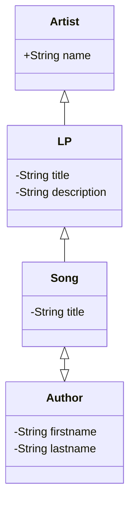

1. [About Discography](#about-discography-laravel-api)
2. [Requirements](#requirements)
3. [Installation](#installation)
4. [Deployment](#deployment)
5. [API usage](#api-usage)
6. [Comments](#comments)
7. [License](#license)

## About Discography Laravel API

This repository is an API that allows API users to CRUD artists, LPs, songs and authors and to list these resources with its relationships.
Database SQLite 3. Diagram of database with relationships:

It is built using the Laravel framework v11:
- Laravel Fortify for login/registration routes
- Laravel Sanctum for API authentication
- Laravel Sail for docker containers
- PHPUnit for testing
**No starter kit is used; the API is built from scratch.** 
**Angular is chosen as the front-end JS framework because it is the bundle used in CodiTramuntana's current project, which is related to the job vacancy. It will be in a separated repository**

## Requirements

- PHP: Version 8.2 or higher.
- Composer: Version 2.x. Must be installed globally and accessible via the composer command.
- Docker:
* For Windows and Mac users: Docker Desktop 25.0 or higher. Docker Desktop includes Docker Compose, which is required for running Laravel Sail.
* For Linux users: Docker 25.0 or higher and Docker Compose. While Docker Desktop is not available for Linux, Docker Compose must be installed separately to work with Laravel Sail. Please follow the official Docker documentation to ensure Docker Compose is installed on your Linux system.

## Installation

1. Clone the repository
2. Run `install.sh` to install and start the docker containers with Laravel Sail
3. Run `bootstrap.sh` to run migrations and seeders

## Deployment

The API uses Laravel Sail to deploy in docker containers. To start the server, run `./vendor/bin/sail up` (or `./vendor/bin/sail up -d` with docker desktop) in the root directory of the project. The API will be available at `localhost:8080`

## API usage

As stated in [About Discography](#about-discography-laravel-api), this repository is an API that allows API users to CRUD artists, LPs, songs and authors and to list these resources with its relationships.
You can see a list of the routes with command: ./vendor/bin/sail artisan route:list
Postman collection with the API routes in the repository and documentation will be provided if needed.
With the endpoints provided is easy to create a front-end application with Angular or any other JS framework with CRUD operations and LIST with relationships, ordering,...

The user created with the Database seeder has the following credentials:
- name: Test User
- email: test@example.com
- password: 123456
  It was not necessary for the task to create a CRUD for application users, so it does not exist.
 
RELATIONSHIPS
- To load the relationships and fields for each API resource check the diagram provided in [About Discography](#about-discography-laravel-api) and add the query "relationships=" to any route. 
  * For example, to list all artists with their LPs and songs, use the route `/api/artists?relationships=lps.songs`
  * You can pass several relationships separated bya a comma. For example, to list all songs with their authors and lp use the route `/api/songs?relationships=lp,authors`

ORDERING
- An order can be applied to the lists of resources with the query "order_by=" and "direction=".
  *   For example, to list all LPs ordered by title desc use the route `/api/LPs?order_by=title&direction=desc`

LIMITING RESULTS
- An attribute "per_page=" can be added to limit the number of results per page.
    * For example, to list the first 5 songs use the route `/api/songs?per_page=5`
      In any case, there is a limit in the config file discography.php for the number of results per page set to 50.

FILTERING
- Filtering is only implemented in artist resource, by name, as an example and for the requirements of the assignment.
- To filter the artists by name, add the query "name=" to the route. 
  * For example, to list all artists that contain "The Beatles" use the route `/api/artists?name=The Beatles`

LOCALIZATION
- Languages Spanish and English are included in the API for resource responses, auth, pagination, passwords and validation.
  * It would be easy to implement other localization files. For example, for exceptions creating an exceptions.php file in the corresponding language folder.
  * To use the feature, the Header 'locale' must be added to the query with the language code ('es' or 'en',  otherwise the locale will be set to 'en'). 

**Example for a request with all the queries: `/api/v1/artist?per_page=2&order_by=name&direction=desc&relationships=lps.songs.authors`**

## Testing

Run the tests with `./vendor/bin/sail test`
The tests are set up in a gitHub action to implement CI/CD in the API. See folder `.github/workflows` for more information.

TESTS INCLUDED
Functional tests for the API:
- Feature tests:
  * health check
  * exception handling
  * mailing
  * middleware for setting the locale
  * for Auth: login/logout/register/reset password (Laravel Fortify features)
  * for routes in the API with "relationships", filter by "name" in artist, "order_by", "direction" and "per_page" queries
  * for the controllers

- Unit tests:
  * for the models: relationships and fillable attributes

No tests are included for validation, as it is a simple task and the validation is already tested in the Laravel framework. But should be included in a real case scenario.

## Comments

In a different and more complex case it would be interesting to add idempotency to the API to handle repetitive requests.
The quickest way would be to add a package like [`square1/laravel-idempotency`](https://packagist.org/packages/square1/laravel-idempotency) but it is not updated for Laravel 11 yet and for the task it is not necessary.

## License

Open-sourced software licensed under the [MIT license](https://opensource.org/licenses/MIT).
